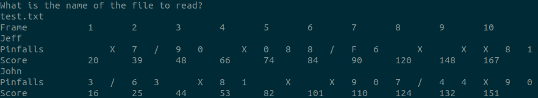

# Bowling Scores Chalenge
Jobsity Coding Challenge

This is a Ruby App that calculates and prints a bowling game table given a file of scores.

## Built With

- Ruby
- RSpec

## Getting Started

To get a local copy run the command:

`git clone https://github.com/jssarrazolaa/Jobsity.git`

on your command-line.

### Prerequisites

- GIT
- Ruby 2.7.x
- Terminal

### Setup

Navigate to the root folderand run `ruby bin/main.rb`

### Install

#### Ruby:
To install Ruby go to this [page](https://www.ruby-lang.org/en/) and follow the instructions given.

### Usage (Game instructions)

- First run `ruby bin/main.rb` in the terminal being in the root folder.
- You will be prompted to enter the name  of the file that you want to scan.
- Enter that name with its extension and hit enter.
- You will see the table with the Scores on it.

👤 **Jhonatan Sarrazola**

- Github: [@jssarrazolaa](https://github.com/jssarrazolaa)
- Twitter: [@StevenAlvarez_](https://twitter.com/StevenAlvarez_)
- Linkedin: [Jhonatan Sarrazola](https://www.linkedin.com/in/jhonatan-sarrazola-6a46a01a5/)

## 🤝 Contributing

Contributions, issues and feature requests are welcome!

Feel free to check the [issues page](https://github.com/pbkabali/Jobsity/issues).

## Show your support

Give a ⭐️ if you like this project!

## 📝 License

This project is [MIT](https://opensource.org/licenses/MIT) licensed.

